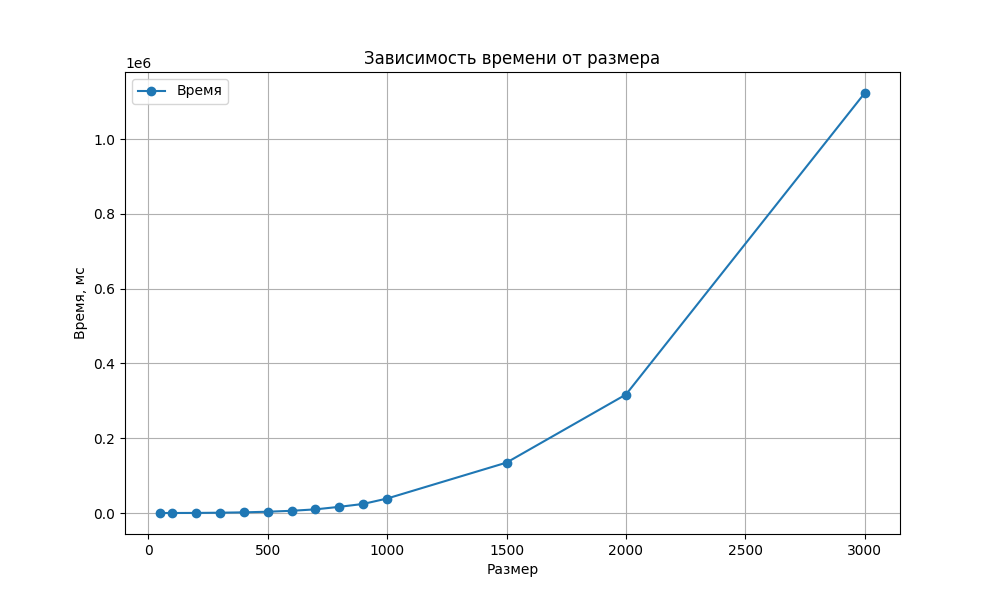

## Отчет по лабораторной работе №1

### Задание на лабораторную работу:
Написать программу на языке C/C++ для перемножения двух матриц.
Исходные данные: файл(ы) содержащие значения исходных матриц.
Выходные данные: файл со значениями результирующей матрицы, время
выполнения, объем задачи.
Обязательна автоматизированная верификация результатов вычислений с помощью
сторонних библиотек или стороннего ПО (например на Matlab/Python).

### Исходный код решения расположен в данном репозитории
* [lab1.cpp](lab1.cpp) - основное задание: генерация, запись/чтение матриц из файла и их умножение
* [check_result.py](check_result.py) - модуль с функцией верификации полученный результатов с помощью библиотеки numpy
* [data](data) - папка со всеми сгенерированными матрицами, результатами умножения и статистикой (изначально данной папки не было и она создана только при выгрузке на гитхаб, для лучшей читаемости репозитория)

### Результаты экспериментов и выводы:
Полученная статистика представлена ниже:

|Размер|Время, мс|
|------------:|-------:|
|50	|7.2928|
|100|	33.525|
|200|	217.177|
|300|	802.646|
|400|	1753.52|
|500|	3417.45|
|600|	5897.9|
|700|	9745.44|
|800|	16514.9|
|900|	24259.4|
|1000|	38733.8|
|1500|	134770|
|2000|	316832|
|3000|	1.1231e+06|

График:

Вывод: При увеличении размерности матриц, время умножения увеличивается значительно. Например при размере матриц в 1000 и 2000, соответственно время увеличивается примерно в 3-4 раза.

Отчет выполнил студент группы 6313-100503D Петров Г.А.