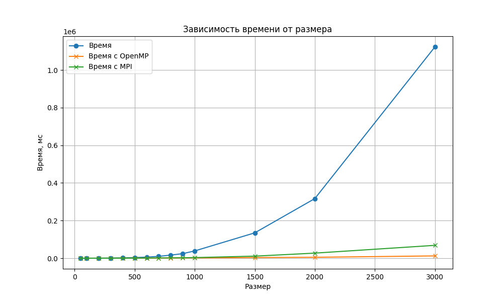

## Отчет по лабораторной работе №3

### Задание на лабораторную работу: 
Модифицировать программу из л/р №1 для параллельной работы по
технологии MPI.

### Исходный код решения расположен в данном репозитории
* [lab3.cpp](lab3.cpp) - основное задание, измененное под 3ую л/р: генерация, запись/чтение матриц из файла и их умножение с помощью OpenMP.
* [check_result.py](check_result.py) - модуль с функцией верификации полученный результатов с помощью библиотеки numpy
* [data](data) - папка со всеми сгенерированными матрицами, результатами умножения и статистикой.

### Результаты экспериментов и выводы: 
Полученная статистика представлена ниже: 

|Размер|Время, мс|
|------------:|-------:|
|50	|23.0744|
|100|	38.4069|
|200|	103.733|
|300|	 204.343|
|400|	362.589|
|500|	585.245|
|600|	877.371|
|700|	1302.3|
|800|	1915.14|
|900|	2555.43|
|1000|	3309.43|
|1500|	10999.9|
|2000|	27032.7|
|3000|	68399.7|

График сравнения время вычислений с OpenMP, MPI и без: 

### Вывод:
MPI ускоряет перемножение матриц равномерно, увеличивая процентный прирост по скорости с увеличением числа элементов матриц, на размере 3000 прирост достигает 10 раз. На маленьких размерах  ускорения нет из-за накладных расходов на создание потоков и конкуренции за память.

 Отчет выполнил студент группы 6313-100503D Петров Г.А.
