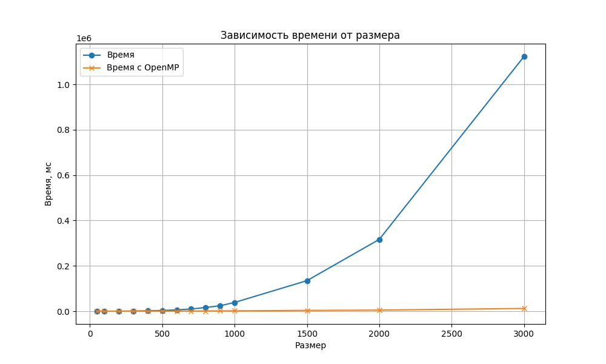

## Отчет по лабораторной работе №2 

### Задание на лабораторную работу: 
Модифицировать программу из л/р №1 для параллельной работы по
технологии OpenMP.

### Исходный код решения расположен в данном репозитории
* [lab2.cpp](lab2.cpp) - основное задание, измененное под 2ую л/р: генерация, запись/чтение матриц из файла и их умножение с помощью OpenMP.
* [check_result.py](check_result.py) - модуль с функцией верификации полученный результатов с помощью библиотеки numpy
* [data](data) - папка со всеми сгенерированными матрицами, результатами умножения и статистикой.

### Результаты экспериментов и выводы: 
Полученная статистика представлена ниже: 

|Размер|Время, мс|
|------------:|-------:|
|50	|100.351|
|100|	46.6623|
|200|	107.209|
|300|	 192.628|
|400|	300.705|
|500|	420.896|
|600|	570.651|
|700|	737.652|
|800|	1149.44|
|900|	1423.7|
|1000|	1664.16|
|1500|	3526.56|
|2000|	4940.25|
|3000|	12276.9|

График сравнения время вычислений с OpenMP и без: 

### Вывод:
 OpenMP ускоряет перемножение матриц равномерно, увеличивая процентный прирост по скорости с увеличением числа элементов матриц, на размере 3000 прирост достигает 10 раз. На размерах до 200 ускорения нет из-за накладных расходов на создание потоков и конкуренции за память.

 Отчет выполнил студент группы 6313-100503D Петров Г.А.
