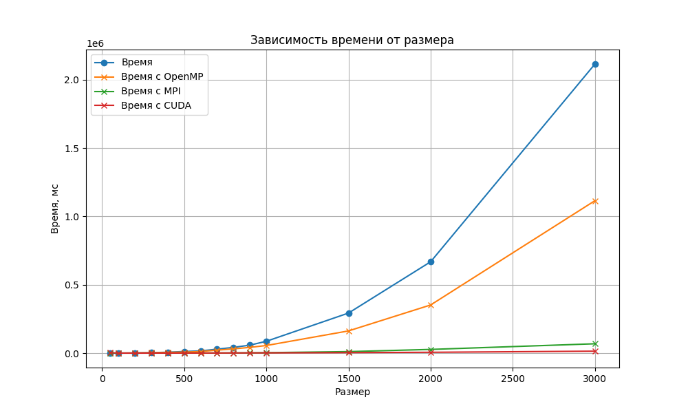

## Отчет по лабораторной работе №4

### Задание на лабораторную работу: 
Модифицировать программу из л/р №1 для параллельной работы по
технологии CUDA.

### Исходный код решения расположен в данном репозитории
* [lab4.cu](lab4.cu) - основное задание, измененное под 4ую л/р: генерация, запись/чтение матриц из файла и их умножение с помощью OpenMP.
* [check_result.py](check_result.py) - модуль с функцией верификации полученный результатов с помощью библиотеки numpy
* [data](data) - папка со всеми сгенерированными матрицами, результатами умножения и статистикой.

### Результаты экспериментов и выводы: 
Полученная статистика представлена ниже: 

Для вычислений использовалась видеокарта GTX 1660 SUPER от NVIDIA

|Размер|Время, мс|
|------------:|-------:|
|50	|3274.73|
|100|	45.779|
|200|	98.2456|
|300|	 181.253|
|400|	282.231|
|500|	401.468|
|600|	554.548|
|700|	710.979|
|800|	1094.77|
|900|	1366.58|
|1000|	1681.34|
|1500|	3704.26|
|2000|	6008.73|
|3000|	14185.7|

График сравнения время вычислений с OpenMP, MPI, CUDA и без: 

### Вывод:
CUDA ускоряет перемножение матриц равномерно, увеличивая процентный прирост по скорости с увеличением числа элементов матриц, на размере 3000 прирост достигает 7-8 раз. На маленьких размерах  ускорения нет из-за накладных расходов на создание потоков и конкуренции за память.

*Конкретно в 3, 4 лабе решил использовать другую IDE для работы, скорее всего она является причиной прироста в производительности такого.

Отчет выполнили студенты группы 6313-100503D Петров Г.А., Владимирцев А.Д.
